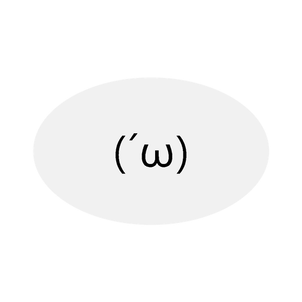

#  Ambery

[English](README.md) | 中文

Ambery 是一个桌面 Agent Harness：监督你的 Claude Code 会话，把它们变成安静、可扫读的陪伴——悬浮宠物、聊天面板和持久卡片。它通过 Claude Code hooks 观察会话生命周期，通过 Windows UIA sidecar 读取终端状态，并让 agent 通过一个小而显式的工具集行动。

## 能做什么

- **Hook 驱动的监督**——Claude Code 的 `SessionStart` / `UserPromptSubmit` / `Stop` / `SessionEnd` / `Notification` hooks 喂给本地后端（仅 loopback）。
- **带宠物 UI 的 agent loop**——Queue → Context → LLM → effects；宠物决定「通知 vs 沉默」，用颜文字状态表达，并借 `call_component` 渲染卡片。
- **全保真 storage**——append-only JSONL 让 OpenAI 请求上下文几乎可以完整复原。
- **可观测性**——`ambery-case` 回放 storage 快照并断言概念结构不变量；`ambery-activity` 是带 turn-aware trajectory 模式的 TUI 查看器。
- **Windows UIA sidecar**——Windows Terminal 的可选增强读取（self-contained win-x64，用户无需 .NET runtime）。

## 平台矩阵

| 平台 | 状态 |
|---|---|
| Windows 10/11 | 一等公民：Tauri 壳 + 托盘 + UIA sidecar + hook 安装脚本 |
| macOS | core 可编译可运行；Hook 驱动的核心体验；无 UIA sidecar |
| Linux | core 可编译可运行；Hook 驱动的核心体验；无 UIA sidecar |

## 快速开始

前置：Rust stable、Node 24 + npm；仅 Windows 侧需要 .NET 9 SDK 构建 UIA sidecar。

```bash
# Rust workspace（core + case runner + activity TUI）
cargo test --workspace

# 前端 headless case（全 mock/keyless，内嵌 core 并拉起 vitest）
cargo run -p ambery-case -- frontend --silent

# 安装 Claude Code hooks（Windows PowerShell）
powershell -File scripts/install-hooks.ps1

# 用 trajectory TUI 查看 storage
cargo run -p ambery-core --bin ambery-activity -- --dir ~/.config/ambery/storage --trajectory
```

浏览器调试宿主：

```bash
cargo run -p ambery-case -- serve --silent
cd app && npm install && npm run dev
```

## 配置

配置与会话数据位于你的用户配置目录下（首次运行自动创建）：

| 平台 | 配置文件 | Storage |
|---|---|---|
| Windows | `%USERPROFILE%\.config\ambery\config.json` | `%USERPROFILE%\.config\ambery\storage\` |
| macOS / Linux | `~/.config/ambery/config.json` | `~/.config/ambery/storage/` |

- `AMBERY_CONFIG_DIR` / `AMBERY_STORAGE_DIR` 可覆盖这两个位置（开发用）。
- **API key 只存在环境变量，从不进 config**——`config.json` 只存变量*名*（如 `"api_key_env": "AMBERY_DEEPSEEK_API_KEY"`）；key 本体设在你的 shell 环境里。默认预设遵循 `AMBERY_<NAME>_API_KEY` 约定。
- 全新安装时 `llm.active` 默认为**未配置**值；首次使用需设置 key 并选择 provider（配置引导会带你走一遍）。
- config 可手改、经设置面板、或经 `ambery-cli`；所有路径走同一条验证管道（docs/config.md）。

## 仓库地图

- `core/` — Rust 核心：Harness、backend、server、storage、filter、TUI activity viewer
- `ambery-case/` — storage 快照回放与概念观测 runner
- `app/` — vanilla TypeScript 前端；`app/src-tauri/` 为 Tauri 壳
- `sidecar/` — C# Windows UIA sidecar
- `docs/` — 分域设计文档；`concepts.md` 术语；`spec.md` 技术选型与结构决定
- `dev/` — 开发记录

## 文档

从 `concepts.md`、`spec.md` 与 `docs/AGENTS.md` 开始。贡献指南见 `CONTRIBUTING.md`。

## License

MIT
