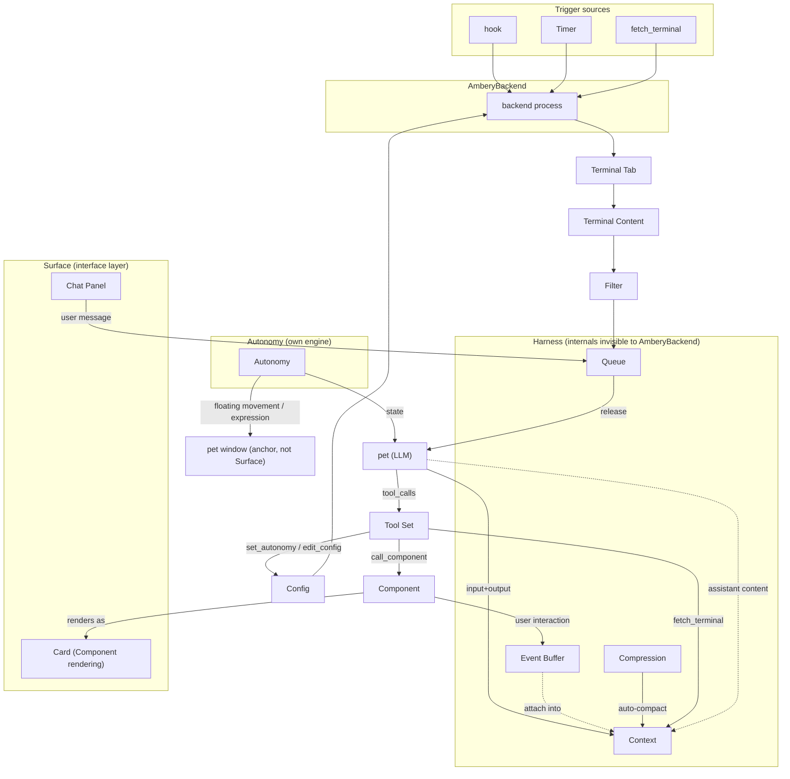

# Concepts

English | [中文](concepts.zh.md)

## Concept List

### 1. AmberyBackend — system
The backend process. Manages the lifecycle of all Code CLI instances: receives hook signals, reads Terminal Content, and stores it into Context via Filter. Executes tool calls issued by pet (LLM), manages persistence, and runs the trigger loop. Loads Config at startup and listens on the HTTP hook port at runtime.

#### 1a. Timer — subconcept
AmberyBackend's fallback scanning mechanism. AmberyBackend maintains an independent Timer for each monitored Code CLI instance, staggered in distribution (to avoid simultaneous scans). The Timer interval is long (e.g. 5 minutes), and only performs a supplementary scan when the hook has not fired for a long time. The hook is the main channel and Timer is the fallback; when `timer.interval_ms ≤ 0` the whole mechanism is disabled (a design decision to keep only hook-driven behavior in the early phase of real hook integration).

### 2. pet — ui
Ambery's human-machine interface, with a built-in LLM, existing in its own floating window (pill-shaped, always-on-top, draggable; the window shows only kaomoji and no other UI elements; scaling is controlled by Config's view_scale). It expresses state through kaomoji and presents information through Components. The user can type-chat with it — pure natural language, no commands. pet understands user intent, analyzes Context, and decides how to express itself. It does not modify code files; its permission boundary is defined by Harness's Tool Set.

### 3. Surface — ui
A user-visible, hideable, restorable logical interface: Chat and Card are Managed Surfaces (unified show / hide / restore semantics); pet itself is the anchor and interaction entry, not a Surface; OS Window is only a physical projection of a Surface; Cards Shelf and Menu are transient popups, not Surfaces.

#### 3a. Chat Panel — subconcept
The interface where the user type-chats with pet. Summoned by pet right-click, not a Component. It includes an input box and conversation history (read from Context). User input is written into Queue for queuing and, after release, enters Context as a `user` role message. Assistant replies stream incrementally: SSE fragments are pushed directly to the frontend via StreamingChannel and rendered piece by piece — a pure display optimization — without going through Queue/Context; the full reply is written to Context only at the end.

### 4. Autonomy — system
pet's autonomous behavior engine. Controls facial expression switching and the floating movement of the pet window. Two control paths: default automatic behavior is defined by the kaomoji mapping table in the system prompt (e.g. Processing → `(ˇωˇ」∠)_` + slow floating, has notification → `✧*｡٩(ˊᗜˋ*)و✧*｡` + bouncing), and does not depend on the LLM; pet can also actively override it via the `set_autonomy` tool call (e.g. suddenly jump, change expression to act cute).

Autonomy's top-level state is expression and animation. State uses keys, not the kaomoji text itself — format `[face: idle, motion: still]`, 4 words + 5 symbols, about 6-7 tokens. It is independent of Queue — whether the state changes or not, it is appended directly to the end of the request context each round, persists in Context (one record per round), and does not enter Queue. The volume is tiny, so there is no cache concern.

> **Autonomy is its own engine, independent of AmberyBackend.** Its state does not go through Queue and enters the context directly.
>
> **Autonomy does not read Code CLI instances.** State key transitions (Processing → Idle, etc.) are driven by AmberyBackend based on hook / Timer; Autonomy only outputs the expression and motion matching the current key.

### 5. Component — ui
A predefined frontend visual card type used for information display. Invoked by pet through Tool Set, and popped out offset from pet toward a suitable direction. The Component protocol defines two layers: ① the system prompt describes type/parameters/usage scenario/text volume ② a CLI-style function call in Tool Set, where the spec parameter is the context content. User interaction events (close, jump, check, etc.) do not write a `user` role and do not go through Queue; they write to Harness's Event Buffer — attached into Context when Queue releases.

### 6. Terminal Window — ui
The terminal-session visual carrier that hosts one Code CLI instance. The concrete form is determined by the Terminal Adapter (wt is a top-level window, zellij is a pane). Multiple instances can exist simultaneously. Positioning and enumeration go through terminal-adapter; no terminal implementation details are bound at the concept layer.

### 7. Terminal Tab — ui
The location identifier of a Code CLI instance in the terminal-session carrier (one instance, one location). The name can be used to locate a marker (e.g. "✳ demo-webapp"). Different terminal adapters have different location models (wt is a tab index, zellij is a pane/tab identifier). Instance and location are 1:1; the concrete locating/activation mechanism is implemented by terminal-adapter.

### 8. Terminal Content — data
The instantaneous full text of a terminal session read via terminal-adapter. It is not read by active polling — AmberyBackend reads it after hook fires, or pet triggers it on demand via the `fetch_terminal` tool. After reading, it is processed by Filter and stored into Context.

### 9. Code CLI (Claude Code command-line instance) — runtime
A Claude Code CLI session running in a Terminal Tab. Tab and Code CLI are a 1:1 relationship. Code CLI is the basic unit managed by AmberyBackend — AmberyBackend does not manage Tabs themselves, but the Code CLI instances running in Tabs. All monitored Code CLI instances form the instance list, persisted in work-agents.jsonl. **Instance identity = the first 8 characters of session_id (sid8)** (same name, different fate: reopening the same project = a new lifecycle and a new hash; the same source as marker location); display name = `<project>·<sid8>`, the same shape as the Tab location marker. Instance discovery = register-on-first-sight (when any hook event arrives with an unknown session_id, register it first) + startup scan (only recognizes tabs with markers).

#### 9a. Status (belief state machine) — subconcept
The runtime state of a Code CLI is a **belief maintained from evidence**, not a tracked fact — Ambery is an observer of processes it does not control and never assumes its lifecycle knowledge is complete (a killed CLI may never report its own close). Belief states:
- **Idle**: confirmed alive, waiting for user input (evidence: SessionStart lands, Stop arrives)
- **Processing**: confirmed working — thinking or executing (**UserPromptSubmit arrives**, driven by the user assigning work, not merely the CLI being open)
- **Unknown**: no confirmed evidence either way and unverifiable (e.g. reads fail, no reader available). It is neither claimed alive nor claimed dead, and is still tracked.
- **Closed**: terminal state — out of the active set, reached on **confirmed** close evidence (SessionEnd hook — the CLI reports its own close; or a positively confirmed "gone": the reader returns NotFound / a process check finds no process), or when an instance stays unknown for too long (lost track of — the confirmed-dead vs lost distinction is deliberately not maintained). A transient read failure is never death; it only defers the belief update.

Belief is updated only by concrete evidence: hook events, terminal reads, and process checks.

#### 9b. hook — subconcept
Claude Code's lifecycle event notification mechanism. Through the global hook configuration (`~/.claude/settings.json`), all Code CLI instances inherit it automatically. The hook type is `"command"` — the hook script reads stdin JSON and POSTs to AmberyBackend's local port (fire-and-forget). Five events are currently used (SessionStart / UserPromptSubmit / Stop / SessionEnd / Notification), processed in layers; the remaining 30+ events are reserved for extension and not currently enabled.

hook fires → AmberyBackend wakes → reads Terminal Content (via terminal-adapter; hook is only a trigger signal and carries no content itself) → Filter → Context → pet decides whether to notify. pet can wake, read, feel that no disturbance is needed, and stay silent.

### 10. Harness (context manager) — system
The data and capability layer pet needs to run. Queue is the global serializing entry — AmberyBackend writes hook content and user messages into Queue. Queue releases serially → Context writes input → LLM → Context writes output → release the next one. Event Buffer is an independent input channel parallel to Queue, receiving Component interaction events. Context updates and Compression are handled internally by Harness, not operated directly by the backend. pet's LLM is based on the OpenAI Chat Completions API model:

- **messages**: the message array, each entry containing `role` (`system` / `user` / `assistant` / `tool`) and `content`
- **tools**: the list of available function definitions, which the LLM invokes by emitting `tool_calls`
- **tool result**: after AmberyBackend executes a tool, it appends a `role: "tool"` message back to messages

#### 10a. Tool Set — subconcept
The function definitions pet can call (CLI-style naming): `call_component` / `fetch_terminal` / `set_autonomy` / `edit_config` / `read_memory` / `write_memory` / `cron_create` / `cron_delete` / `sleep`. pet itself cannot perform any operation — it can only emit `tool_calls`; AmberyBackend executes them and appends the result back to Context as a `tool` role message. Tool Set is also pet's permission boundary: ❌ modifying code files.

#### 10b. Context — subconcept
pet's external information injection channel, persisted in Harness. Each record carries a timestamp. Context is the complete message array (mirroring OpenAI messages), the context source for LLM requests, and the persistent archive of the full conversation. The data model and processing chain belong to the design docs. Through Context, pet obtains non-conversation information such as Code CLI instance states and task background.

#### 10c. Queue (input serialization gate) — subconcept
The serial Queue for all inputs, persisted in Harness. hook content, user messages, and merged Event Buffer events all enter Queue first. **Queue is the controller of the system's processing rhythm** — after each input is released, the entire round must finish (input written to Context → LLM call → tool execution → assistant output written to Context) before the next one is released; the OpenAI API must not be called in parallel. The LLM's assistant replies and tool results do not go through Queue and enter Context directly.

```
Input1 → Queue → Context → LLM → tool_calls? → call LLM again ─→ output → Context ✓
Input2 → Queue (waiting in line)─────────────────────────────────────→ released → Context → LLM → ...
```

#### 10d. Compression — subconcept
Triggers when Context exceeds the token threshold (auto-compact): measured by the usage truth, threshold calibrated by the model's `context_window`, a dedicated LLM call generates a summary + shaking keeps complete turns + reset and re-diff. It ensures the context of every LLM call stays within budget.

#### 10e. Event Buffer — subconcept
The independent input channel for Component interaction events, parallel to Queue: interactions are written in short natural language (optionally with a structured snapshot attached); when the LLM is triggered, they are merged into one `system` message and attached into Context, then cleared; they never write a `user` role.

#### 10f. Memory (persistent understanding buffer) — subconcept
The persistent buffer the Agent uses to continuously record and recover its own understanding, replacing the Agent directly manipulating the filesystem to write notes. Memory is independent from Context, Compression summaries, and terminal content archives respectively: the first is the Agent's actively maintained long-term understanding, while the latter are run records or reference data. It is persisted and managed by Harness, manageable by the backend and the user, and adjusted by the Agent through the read/write Memory tools.

#### 10g. Cron (persistent scheduling and delayed dispatch) — subconcept
Harness's persistent scheduling and delayed-dispatch capability. It records future work, for example prompting the Agent with a daily report every night; it also supports continuing a planned action after a short wait, for example waiting a few seconds before calling `set_autonomy`. The backend, the user, and the Agent can all view or adjust Cron; the Agent manages it through the two Cron tools, and the `sleep` tool expresses a short wait. Cron and sleep share the same Harness scheduling implementation.

```
Component interaction ─→ Event Buffer (backlog)
                     ↓ attached when Queue releases
                   Context (merged into a system message)
                     ↓
                   LLM ─→ Context
```

| | Queue | Event Buffer |
|---|---|---|
| Input source | hook content, user messages | Component interaction events |
| Processing | Serial Queue, processed one at a time | Backlog, merged into one when the LLM triggers |
| Persistence | append-only queue.jsonl | Not persisted (cleared after merge) |
| Output direction | Context archive + LLM request body | Injected into the LLM request context after merge |
| Role | Input serialization gate | Merge staging area for low-priority events |

### 11. Filter — system
Extracts effective information from Terminal Content, removes noise, and detects changes (denoise / normalize / change detection). Filter is a replaceable strategy — different terminal types or Code CLI versions may need different filter rules. It is applied on the "Content → Context" chain.

### 12. Config — system
The persistent configuration for AmberyBackend and pet (LLM profiles, Timer, Compression, kaomoji pool, pet appearance, theme, language, pet name, tool budget, etc.). Loaded at runtime. Filter is chosen by the instance hook `kind`, not by global Config. pet can query and modify on demand within a restricted Config projection via `edit_config`; the system-prompt assembly rules belong to the design docs.

### 13. Storage — system
The persistence layer for runtime data. It is the same type as Config (persistent files) but with a different purpose: Config stores startup configuration, while Storage stores session data and Harness persistent state (read/write). Layout and file semantics belong to the design docs. It is preserved across AmberyBackend lifecycles, and full conversations and future plans are restored after a restart.

### 14. Terminal Adapter — system
The terminal access abstraction: a unified interface providing "locate, read, unlocate" capabilities for Code CLI instances. It is an instantiable kind of thing — one implementation corresponds to one terminal type (wt is a separate C# process, zellij CLI); multi-terminal compatibility = abstract interface + per-terminal dispatch implementation.

### 15. Platform Primitives — system
The abstraction group for platform-specific capabilities (not called adapter): OS-layer capabilities reused across terminals, such as virtual desktop switching. Consumed by Terminal Adapter (when the target is invisible while reading → switch desktop then read; interruptive switching is gated by explicit consent). The Windows implementation uses COM; other platforms have their corresponding implementations.

---

## Examples

### Example A: SessionStart hook auto-registers a new Code CLI

> The user starts Claude Code CLI in the "new-feature" project. SessionStart is configured in the global hooks.

1. **Code CLI** starts, **hook** (SessionStart) fires — the hook script outputs `sessionTitle: "new-feature·a1b2c3d4"` (the marker location anchor) and fire-and-forget POSTs to **AmberyBackend**'s local port
2. **AmberyBackend** register-on-first-sight: session_id seen for the first time → creates an instance record (hash=session_id, state Idle) and writes it to work-agents.jsonl
3. Location probe: enumerate **Terminal Window** via **Terminal Adapter**, find the corresponding **Terminal Tab** by the marker prefix, and cache `{hwnd, index}` (lazy retry on miss)
4. One minimal text enters **Event Buffer** ("new instance new-feature·a1b2c3d4 registered"), and is attached into **Context** at the next Queue release — **silent bookkeeping, pet does not wake**
5. The user inputs the first prompt → **UserPromptSubmit** fires: the prompt enters **Queue** for observation injection, the state turns **Processing**, and pet is woken to evaluate only now

### Example B: Code CLI finishes, hook fires, pet notifies the user and converses

> demo-webapp's Code CLI fixed a bug and rebuilt; the stophook fires.

1. **Code CLI** "demo-webapp" completes all tasks, **Status** becomes Idle
2. **hook** (Stop) fires, **AmberyBackend** wakes
3. AmberyBackend locates and switches to **Terminal Tab** "demo-webapp" via **Terminal Adapter**
4. It reads **Terminal Content** (4958 chars) via **Terminal Adapter**, **Filter** filters the noise, the result is injected into **Queue** as a system message, and **Queue** processes it serially and archives it into **Context**
5. **pet** uses **LLM** to judge that the output is meaningful (fixed a bug + rebuilt + waiting for tests) → decides to notify
6. Kaomoji `✧*｡٩(ˊᗜˋ*)و✧*｡`, calls **Component** via **Tool Set** to display the task result on **Surface**
7. The user types a follow-up in **Surface** (Chat) to **pet**: "What exactly happened with that relay-checker bug?"
8. The message enters **Queue**, pet takes it, looks up demo-webapp's full text from **Context**, and **LLM** analyzes and replies to the user

### Example C: hook fires but the content is thin, pet stays silent, and the user queries later

> release-sweep's Code CLI finished code sanitization cleanup; the stophook fires, but the output is very short.

1. **Code CLI** "release-sweep" finishes, **hook** (Stop) fires, **AmberyBackend** wakes
2. AmberyBackend switches to **Terminal Tab** "release-sweep" via **Terminal Adapter**, reads **Terminal Content**, and **Filter** filters it
3. It is stored into **Context** — only 30 chars: "Cleaned up 2 lines of comments, nothing else sensitive"
4. **pet** uses **LLM** to judge: little output, no anomaly, no to-do → decides to stay silent
5. An hour later, the user types in **Surface** (Chat) to **pet**: "Did anyone finish anything just now?"
6. The message enters **Queue**, pet takes it, and scans the Code CLI records in **Context**. config-service's last hook did not fire, but the **Timer** fallback scan has already updated its Context
7. pet replies: "release-sweep finished an hour ago, just cleaned up two lines of comments, nothing much. config-service is still running."

### Example D: Two hooks arrive concurrently, Queue processes them in order, Filter decides who is worth telling

> config-service and anim-toolkit, two Code CLIs, finish almost simultaneously.

1. **Code CLI** "config-service" and "anim-toolkit" finish almost simultaneously, and both **Status** become Idle
2. Two **hooks** (Stop) almost simultaneously HTTP POST to **AmberyBackend**
3. AmberyBackend processes config-service first: switches to **Terminal Tab** via **Terminal Adapter**, reads **Terminal Content**
4. **Filter** denoises + compares with the last Context — the content has many new config changes, detected as a substantial difference
5. AmberyBackend injects a system message into **Queue**: "config-service finished ({len} chars). Evaluate whether to notify." — the filtered content is simultaneously stored into **Context** as an archive
6. AmberyBackend then processes anim-toolkit: the same flow, **Filter** compares with the last Context — the content is almost identical (only a rebuild) → detected as no substantial difference. It injects a system message into Queue and stores it into Context
7. **Queue** serializes the two inputs. **pet** processes the first one in order
8. pet uses **LLM** to analyze config-service's Context: many config changes, wide impact → decides to notify. It calls **Component** via **Tool Set** to display the result on **Surface**
9. After this LLM call ends, the second input in Queue is fed to pet
10. pet analyzes anim-toolkit: no substantial change → decides to stay silent

### Example E: Bootstrap — AmberyBackend starts and loads Config

> When AmberyBackend first starts or restarts, it loads all runtime settings from the Config file.

1. **AmberyBackend** starts and reads the **Config** file
2. Config defines the **hook** global configuration: the SessionStart and Stop events in `~/.claude/settings.json`, HTTP POST to AmberyBackend's local port
3. Config specifies the **Filter** policy: chooses the denoise rule set (ANSI escape codes, spinners, progress bar patterns, etc.), the normalization method, and the change-detection threshold
4. Config defines the **Timer** parameters: the fallback scan interval for each Code CLI instance and the stagger distribution offset
5. Config sets the **Autonomy** behavior mapping and **Compression** token threshold
6. Config specifies the **Harness** path and **Storage** persistence directory
7. AmberyBackend initialization complete — loads the Code CLI instance list, assembles the system prompt, and listens on the HTTP hook port — the **Timer** mechanism is ready, and pet appears

### Example F: Context over the threshold triggers Compression; the target instance is on another virtual desktop

> After a long session, **Context** exceeds the token threshold and triggers **Compression**; meanwhile the user asks about an instance running on another virtual desktop, and reading it needs **Platform Primitives** to switch desktops.

1. **Context** has accumulated a lot of history; **Harness** detects that "recent usage truth + increment" exceeds the `context_window − reserve` threshold
2. **Harness** launches a separate LLM summary call, compresses the history into one `system` summary, replaces the old messages, and keeps only the recent N original messages (shaking) — **Compression** treats the context as reset and clears the diff baseline; **Memory**'s long-term understanding and **Cron** plans are unaffected by compression and survive across compressions
3. The user types in **Surface** (Chat) to **pet**: "How is that sandbox-cli instance doing?"
4. The message enters **Queue**, and **AmberyBackend** locates **Terminal Tab** "sandbox-cli" via **Terminal Adapter**, but the target is on another virtual desktop (cloaked)
5. **Terminal Adapter** calls **Platform Primitives**' `switch_vd` to switch to the target desktop, then reads **Terminal Content**
6. The read content goes through **Filter** into **Context**, and **pet** uses **LLM** to analyze and reply to the user

---

## Concept × Example Coverage

| Concept | A: SessionStart | B: Stop notify | C: silent query | D: concurrent+filter | E: Bootstrap | F: Compression re-diff |
|---|---|---|---|---|---|---|
| AmberyBackend | ✅ | ✅ | ✅ | ✅ | ✅ | ✅ |
| Timer | — | — | ✅ | — | ✅ | — |
| pet | ✅ | ✅ | ✅ | ✅ | ✅ | ✅ |
| Surface | — | ✅ | ✅ | ✅ | — | ✅ |
| Chat Panel | — | ✅ | ✅ | — | — | ✅ |
| Autonomy | ✅ | ✅ | — | ✅ | ✅ | — |
| Component | ✅ | ✅ | — | ✅ | — | — |
| Terminal Window | ✅ | — | — | — | — | — |
| Terminal Tab | ✅ | ✅ | ✅ | ✅ | — | ✅ |
| Terminal Content | ✅ | ✅ | ✅ | ✅ | — | ✅ |
| Code CLI | ✅ | ✅ | ✅ | ✅ | ✅ | — |
| Status | ✅ | ✅ | — | ✅ | — | — |
| hook | ✅ | ✅ | ✅ | ✅ | ✅ | — |
| Harness | ✅ | — | — | — | ✅ | ✅ |
| Tool Set | ✅ | ✅ | — | ✅ | — | — |
| Context | ✅ | ✅ | ✅ | ✅ | — | ✅ |
| Queue | — | ✅ | ✅ | ✅ | — | ✅ |
| Compression | — | — | — | — | — | ✅ |
| Event Buffer | — | ✅ | — | ✅ | — | — |
| Memory | — | — | — | — | — | ✅ |
| Cron | — | — | — | — | — | ✅ |
| Filter | — | ✅ | ✅ | ✅ | ✅ | ✅ |
| Config | — | — | — | — | ✅ | — |
| Storage | — | — | — | — | ✅ | — |
| Terminal Adapter | ✅ | ✅ | ✅ | ✅ | — | ✅ |
| Platform Primitives | — | — | — | — | — | ✅ |

---

## Data Flow

```
                 hook / Timer / fetch_terminal
                            │
                            ▼
Config ──► AmberyBackend ──► Terminal Tab ──► Terminal Content ──► Filter
  │            │                                                         │
  │            │                                              ┌──────────┘
  │            │                                              ▼
  │            │                                           Queue ◄──── Chat Panel
  │            │                                      (input queue,       (user input)
  │            │                                       serial release,
  │            │                                       one per round)
  │            │                                              │
  │            │                         release one input    │
  │            │                       (attach Event Buffer    │
  │            │                        merged as one message) │
  │            │                                              ▼
  │            │                              ┌──────────Context──────────┐
  │            │                              │ complete message array:    │
  │            │                              │ released input + assistant/│
  │            │                              │ tool output (LLM context  │
  │            │                              │ source, full conversation │
  │            │                              │ archive)                   │
  │            │                              └───┬────────────────▲──────┘
  │            │           Compression             │ request body   │ output
  │            │          (auto-compact acts       │ (+assembled    │ write
  │            │           on Context:             │  request header│ back
  │            │           summary+shaking+        │  +Autonomy at  │
  │            │           reset re-diff)          │  end)          │
  │            │                                   ▼                │
  │            │                                pet (LLM) ─────────┘
  │            │                                     │
  │            │                                Tool Set
  │            │                        call_component / fetch_terminal
  │            │                        set_autonomy / edit_config
  │            │                                     │
  │            │                       ┌─────────────┼──────────┐
  │            │                       ▼             ▼          ▼
  │            │                  Component      fetch_      edit_
  │            │                  (offset from    terminal    config
  │            │                   pet center)
  │            │                       │
  │            │                  (user interaction)
  │            │                       ▼
  │            │                  Event Buffer (not persisted)
  │            │                       │ attached when Queue releases,
  │            │                       │ merged as one system message
  │            │                       └──────────────► Context
  │            │
  │            │     Autonomy (own engine: expression/position/animation) ──► pet window (kaomoji rendering, floating movement)
  │            │     (state appended to the LLM request end, not through Queue)
  │            │
  │            │     Surface (interface layer): Chat / Card are Managed Surfaces; pet window is the anchor (not Surface)
  │            │
  └── Storage (persists queue.jsonl / context.jsonl / instance list / effect.jsonl / terminal-content.jsonl)
```

> **Harness boundary**: Queue and Event Buffer are exposed to AmberyBackend for read/write. hook content and user messages enter the system through Queue; Component interactions enter the system through Event Buffer. Context updates + Compression are Harness-internal mechanisms. Autonomy is its own engine, and its state goes directly to the end of the request, not through Queue.


