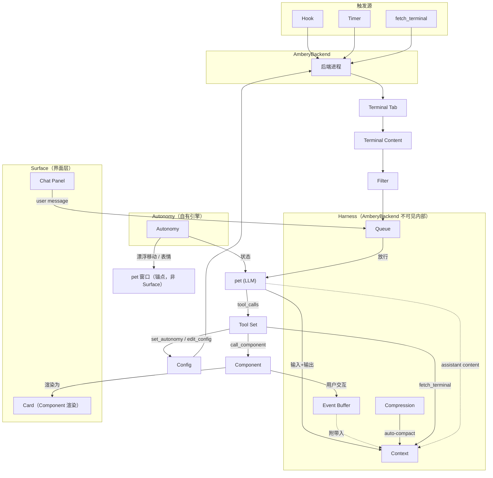

# Concepts

[English](concepts.md) | 中文

## Concept List

### 1. AmberyBackend（后端）— system
后端进程。管理所有 Code CLI 实例的生命周期：接收 Hook 信号、读取 Terminal Content、经 Filter 存入 Context。执行 pet（LLM）发出的 tool call、管理持久化、运行触发循环。启动时加载 Config，运行时监听 HTTP Hook 端口。

#### 1a. Timer（定时器）— 子概念
AmberyBackend 的兜底扫描机制。AmberyBackend 为每个被监控的 Code CLI 实例维护独立的 Timer，错峰分布（避免同时扫描）。Timer 间隔较长（如 5 分钟），仅在 Hook 长时间未触发时补扫一次。Hook 是主通道，Timer 是兜底；`timer.interval_ms ≤ 0` 时整体禁用（真实 hook 接入初期只留 hook 驱动的设计决定）。

### 2. pet（宠物）— ui
Ambery 的人机界面，内置 LLM，存在于自身的浮动窗口中（pill 形状，always-on-top，可拖拽；窗内仅显示颜文字，无其他 UI 元素，缩放由 Config 的 view_scale 控制）。通过颜文字表达状态，通过 Component 展示信息。用户可与之打字聊天——纯自然语言，无指令。pet 理解用户意图、分析 Context、决定表达方式。不修改代码文件，权限边界由 Harness 的 Tool Set 限定。

### 3. Surface（界面层）— ui
用户可见、可隐藏、可恢复的逻辑界面：Chat 与 Card 为 Managed Surface（显示 / 隐藏 / 恢复语义统一）；pet 自身是锚点与交互入口，不属于 Surface；OS Window 只是 Surface 的物理投影；Cards Shelf 与 Menu 是瞬时弹出层，不属于 Surface。

#### 3a. Chat Panel（聊天面板）— 子概念
用户与 pet 打字聊天的界面。由 pet 右键唤出，不是 Component。包括输入框和对话历史（从 Context 读取）。用户输入写入 Queue 排队，放行后作为 `user` role 消息入 Context。assistant 回复的流式增量显示：SSE 片段经 StreamingChannel 直推前端逐片渲染，纯显示优化——不经 Queue/Context，完整回复最后才写 Context。

### 4. Autonomy（自主行为层）— system
pet 的自主行为引擎。控制面部表情切换、pet 窗口的漂浮移动。两路控制：默认自动行为由 system prompt 中的颜文字映射表定义（如 Processing → `(ˇωˇ」∠)_` + 缓慢浮动，有通知 → `✧*｡٩(ˊᗜˋ*)و✧*｡` + 跳动），不依赖 LLM；pet 也可通过 `set_autonomy` tool call 主动覆盖（如突然跳一下、换个表情卖萌）。

Autonomy 的顶层状态是表情与动画。状态用 key，不加颜文字本体——格式 `[face: idle, motion: still]`，4 个单词 + 5 个符号，约 6-7 token。与 Queue 无关——无论状态变化与否，每轮直接附加到请求上下文末端，持久于 Context（每轮一条记录），不落 Queue。量级极小，不存在 cache 担忧。

> **Autonomy 是自有引擎，独立于 AmberyBackend。** 状态不经过 Queue，直接进入上下文。
>
> **Autonomy 不读取 Code CLI 实例。** 状态 key 的切换（Processing → Idle 等）由 AmberyBackend 根据 Hook / Timer 驱动，Autonomy 只按当前 key 输出对应的表情与动作。

### 5. Component（组件）— ui
预定义的前端可视化卡片类型，用于信息展示。由 pet 通过 Tool Set 调用，以 pet 为中心向合适方位偏移弹出。Component 协议定义两层：① system prompt 描述类型/参数/使用场景/文本量级 ② Tool Set 中 CLI 风格的 function call，spec 参数即为上下文内容。用户交互事件（关闭、跳转、勾选等）不写 `user` role、不经 Queue，写 Harness 的 Event Buffer——Queue 放行时附带入 Context。

### 6. Terminal Window（终端会话载体）— ui
承载一个 Code CLI 实例的终端会话可视载体。具体形态由终端适配器决定（wt 是顶层窗口、zellij 是 pane）。多个实例可同时存在。定位与枚举经 terminal-adapter 进行，不在概念层绑定任何终端实现细节。

### 7. Terminal Tab（实例位置）— ui
Code CLI 实例在终端会话载体中的位置标识（一个实例一个位置）。名称可用于定位 marker（如 "✳ demo-webapp"）。不同终端适配器有不同的位置模型（wt 是标签页索引、zellij 是 pane/tab 标识）。实例与位置 1:1；具体定位/激活机制由 terminal-adapter 实现。

### 8. Terminal Content（终端文字）— data
经 terminal-adapter 读到的终端会话瞬时全量文字。不是主动轮询读取——Hook 触发后 AmberyBackend 读取，或 pet 通过 `fetch_terminal` tool 按需触发。读取后经 Filter 处理，存入 Context。

### 9. Code CLI（Claude Code 命令行实例）— runtime
一个 Terminal Tab 里运行的 Claude Code CLI 会话。Tab 与 Code CLI 是 1:1 关系。Code CLI 是 AmberyBackend 管理的基本单元——AmberyBackend 不管理 Tab 本身，而是管理 Tab 中运行的 Code CLI 实例。所有被监工的 Code CLI 实例汇成实例清单，持久化在 work-agents.jsonl。**实例身份 = session_id 前 8 位（sid8）**（同名不同命：同项目重开 = 新生命周期新 hash；与 marker 定位同源）；display 名 = `<project>·<sid8>`，与 Tab 定位标记同构。实例发现 = register-on-first-sight（任何 hook 事件到达时未知 session_id 先落注册）+ 启动扫描（只认带 marker 的 tab）。

#### 9a. Status（状态机）— 子概念
Code CLI 的运行时状态，由 hook 事件驱动：
- **Idle**：Code CLI 等待用户输入（SessionStart 落地、Stop 到达）
- **Processing**：Code CLI 正在思考或执行（**UserPromptSubmit 到达**——用户派活驱动，而非 CLI 开着）
- **Unknown**：无法判定（如 Tab 内不是 Code CLI）
- **Closed**：终态。首要信号 = **SessionEnd Hook**（真实关闭）；Timer 兜底扫描发现 tab 不复存在为兜底（无 hook 实例）

#### 9b. Hook（钩子）— 子概念
Claude Code 的生命周期事件通知机制。通过全局 Hook 配置（`~/.claude/settings.json`），所有 Code CLI 实例自动继承。Hook 类型为 `"command"`——hook 脚本读 stdin JSON 后 POST 到 AmberyBackend 本地端口（fire-and-forget）。当前使用五个事件（SessionStart / UserPromptSubmit / Stop / SessionEnd / Notification），分层处理；其余 30+ 事件保留扩展空间，当前不启用。

Hook 触发 → AmberyBackend 被唤醒 → 读 Terminal Content（经 terminal-adapter，hook 只当触发信号不自带内容）→ Filter → Context → pet 决定是否通知。pet 可以醒了、读了、觉得不需要打扰，沉默。

### 10. Harness（上下文管理器）— system
pet 运行所需的数据与能力层。Queue 是全局串行化入口——AmberyBackend 将 hook 内容和 user 消息写入 Queue。Queue 串行放行→Context 写输入→LLM→Context 写输出→放行下一条。Event Buffer 是与 Queue 平行的独立输入通道，收 Component 交互事件。Context 更新和 Compression 由 Harness 内部负责，不经后端直接操作。pet 的 LLM 基于 OpenAI Chat Completions API 模型：

- **messages**：消息数组，每条含 `role`（`system` / `user` / `assistant` / `tool`）和 `content`
- **tools**：可用的 function definitions 列表，LLM 通过 emit `tool_calls` 调用
- **tool result**：AmberyBackend 执行 tool 后，以 `role: "tool"` message 追加回 messages

#### 10a. Tool Set（工具集）— 子概念
pet 可调用的 function definitions（CLI 风格命名）：`call_component` / `fetch_terminal` / `set_autonomy` / `edit_config` / `read_memory` / `write_memory` / `cron_create` / `cron_delete` / `sleep`。pet 自身不能执行任何操作——它只能 emit `tool_calls`，由 AmberyBackend 执行后将 result 以 `tool` role message 追加回 Context。Tool Set 也是 pet 的权限边界：❌ 修改代码文件。

#### 10b. Context（上下文）— 子概念
pet 的外部信息注入通道，持久化在 Harness 中。每条记录带时间戳。Context 是完整消息数组（对标 OpenAI messages），是 LLM 请求的上下文源，也是完整对话的持久化存档。数据模型与处理链路归设计文档。pet 通过 Context 获得 Code CLI 实例状态、任务背景等非对话信息。


#### 10c. Queue（输入串行化关口）— 子概念
所有输入的串行排队器，持久化在 Harness 中。hook 内容、user 消息、Event Buffer 合并事件全部先入 Queue 排队。**Queue 是系统处理节奏的控制器**——每条输入放行后，必须等整轮处理完毕（输入写 Context → LLM 调用 → tool 执行 → assistant 输出写 Context）才放行下一条，不可并行调用 OpenAI API。LLM 的 assistant 回复和 tool 结果不走 Queue，直接入 Context。

```
输入1 → Queue → Context → LLM → tool_calls? → 再调 LLM ─→ 输出 → Context ✓
输入2 → Queue（排队等待）─────────────────────────────────────→ 放行 → Context → LLM → ...
```

#### 10d. Compression（上下文压缩）— 子概念
Context 超 token 阈值时触发（auto-compact）：以 usage 真值计量、按模型 `context_window` 标定阈值、专项 LLM 调用生成摘要 + shaking 保留完整 turn + 归零重 diff。确保每轮 LLM 调用的上下文始终在预算内。

#### 10e. Event Buffer（交互事件缓冲区）— 子概念
Component 交互事件的独立输入通道，与 Queue 平行：交互以短自然语言（可附结构化快照）写入，LLM 触发时合并为一条 `system` message 附带入 Context 后清空，永不写 `user` role。

#### 10f. Memory（持久化理解 buffer）— 子概念
Agent 用来持续记录和恢复自身理解的持久化 buffer，替代 Agent 直接操作文件系统写笔记。Memory 与 Context、压缩摘要、终端内容存档分别独立：前者是 Agent 主动维护的长期理解，后者是运行记录或参考数据。它由 Harness 持久化管理，后端与用户可管理，Agent 通过读写 Memory tools 调整。

#### 10g. Cron（持久化计划与延时调度）— 子概念
Harness 的持久化计划与延时调度能力。它记录未来工作，例如每天夜间向 Agent 发出日报提示；也支持短暂等待后继续既定动作，例如先等待数秒再调用 `set_autonomy`。后端、用户和 Agent 都可查看或调整 Cron；Agent 通过两个 Cron tools 管理，另有 `sleep` tool 表达短暂等待。Cron 与 sleep 共用同一个 Harness 调度实现。

```
Component 交互 ─→ Event Buffer（积压）
                     ↓ Queue 放行时附带入
                   Context（合并为 system 消息）
                     ↓
                   LLM ─→ Context
```

| | Queue | Event Buffer |
|---|---|---|
| 输入源 | Hook 内容、user 消息 | Component 交互事件 |
| 处理方式 | 串行排队，逐个处理 | 积压，LLM 触发时合并为一条 |
| 持久化 | append-only queue.jsonl | 不持久化（合并后清空） |
| 输出方向 | Context 存档 + LLM 请求体 | 合并后注入 LLM 请求上下文 |
| 角色定位 | 输入串行化关口 | 低优先级事件的合并暂存区 |

### 11. Filter（过滤器）— system
从 Terminal Content 中提取有效信息、去除噪音、检测变化（去噪 / 归一 / 变化检测）。Filter 是可替换策略——不同终端类型或 Code CLI 版本可能需要不同过滤规则。应用于「Content → Context」链路。

### 12. Config（配置）— system
AmberyBackend 和 pet 的持久化配置（LLM profiles、Timer、Compression、表情池、pet 外观、主题、语言、pet 名称与工具预算等）。运行时加载。Filter 按实例 hook `kind` 选择，不是全局 Config。pet 可通过 `edit_config` 在受限 Config 投影中按需查询与修改；system prompt 现拼规则归设计文档。

### 13. Storage（持久化存储）— system
运行时数据的持久化层。与 Config 同类型（持久化文件），用途不同：Config 存启动配置，Storage 存 session 数据与 Harness 持久化状态（读写）。布局与文件语义归设计文档。跨 AmberyBackend 生命周期保留，重启后恢复完整对话和未来计划。

### 14. Terminal Adapter（终端适配器）— system
终端访问抽象：向 Code CLI 实例提供「定位、读取、遗忘」能力的统一接口。它是可实例化的一类东西——一个实现对应一个终端类型（wt 独立 C# 进程、zellij CLI），多终端兼容 = 抽象接口 + 按终端分发实现。

### 15. Platform Primitives（平台原语）— system
平台特定能力的抽象组（不叫 adapter）：虚拟桌面切换等跨终端复用的 OS 层能力。被 Terminal Adapter 消费（读取时目标不可见 → 切桌面后读；打断性切换经显式同意门控）。Windows 实现走 COM；其他平台各有对应实现。

---

## Examples

### Example A: SessionStart Hook 自动注册新 Code CLI

> 用户在 "new-feature" 项目中启动 Claude Code CLI。全局 Hook 中配置了 SessionStart。

1. **Code CLI** 启动，**Hook**（SessionStart）触发——hook 脚本输出 `sessionTitle: "new-feature·a1b2c3d4"`（marker 定位锚）并 fire-and-forget POST 到 **AmberyBackend** 本地端口
2. **AmberyBackend** register-on-first-sight：session_id 初见 → 创建实例记录（hash=session_id，状态 Idle），写入 work-agents.jsonl
3. 定位探测：经 **Terminal Adapter** 枚举 **Terminal Window**，按 marker 前缀找到对应 **Terminal Tab**，缓存 `{hwnd, index}`（未命中则惰性重试）
4. 一条最小文字进 **Event Buffer**（「新实例 new-feature·a1b2c3d4 注册」），下次 Queue 放行时附带入 **Context**——**静默簿记，pet 不醒**
5. 用户输入第一个 prompt → **UserPromptSubmit** 触发：prompt 进 **Queue** 观察注入，状态转 **Processing**，pet 此时才被唤醒评估

### Example B: Code CLI 完成，Hook 触发，pet 通知用户并对话

> demo-webapp 的 Code CLI 修完 bug 并重新构建，stophook 触发。

1. **Code CLI** "demo-webapp" 所有任务完成，**Status** 变为 Idle
2. **Hook**（Stop）触发，**AmberyBackend** 被唤醒
3. AmberyBackend 经 **Terminal Adapter** 定位并切换到 **Terminal Tab** "demo-webapp"
4. 经 **Terminal Adapter** 读取 **Terminal Content**（4958 字），**Filter** 过滤噪音，作为 system 消息注入 **Queue**，**Queue** 串行处理后存档至 **Context**
5. **pet** 用 **LLM** 判断输出有意义（修了 bug + 重新构建 + 等测试）→ 决定通知
6. 颜文字 `✧*｡٩(ˊᗜˋ*)و✧*｡`，通过 **Tool Set** 调 **Component** 在 **Surface** 展示任务结果
7. 用户在 **Surface**（Chat）对 **pet** 打字追问："relay-checker 那个 bug 具体怎么回事？"
8. 消息进 **Queue**，pet 取出，从 **Context** 查 demo-webapp 全文，**LLM** 分析后回复用户

### Example C: Hook 触发但内容少，pet 沉默，用户事后查询

> release-sweep 的 Code CLI 完成了代码脱敏清理，stophook 触发，但输出很短。

1. **Code CLI** "release-sweep" 完成，**Hook**（Stop）触发，**AmberyBackend** 唤醒
2. AmberyBackend 经 **Terminal Adapter** 切到 **Terminal Tab** "release-sweep"，读 **Terminal Content**，**Filter** 过滤
3. 存入 **Context** — 仅 30 字："清理了 2 行注释，无其他敏感内容"
4. **pet** 用 **LLM** 判断：输出很少、无异常、无待办 → 决定沉默
5. 一小时后，用户在 **Surface**（Chat）对 **pet** 打字："刚才有谁干完了吗？"
6. 消息进 **Queue**，pet 取出，扫描 **Context** 中的 Code CLI 记录。config-service 上次 Hook 未触发，但 **Timer** 兜底扫描已更新其 Context
7. pet 回复："release-sweep 一小时前跑完了，就清了两行注释，没啥事。config-service 还在跑。"

### Example D: 两个 Hook 并发到达，Queue 顺序处理，Filter 决定谁值得说

> config-service 和 anim-toolkit 两个 Code CLI 几乎同时完成。

1. **Code CLI** "config-service" 和 "anim-toolkit" 几乎同时完成，**Status** 均变为 Idle
2. 两个 **Hook**（Stop）几乎同时 HTTP POST 到 **AmberyBackend**
3. AmberyBackend 先处理 config-service：经 **Terminal Adapter** 切到 **Terminal Tab**，读 **Terminal Content**
4. **Filter** 去噪 + 对比上次 Context——内容有大量新增配置变更，检测为有实质差异
5. AmberyBackend 向 **Queue** 注入 system 消息："config-service 完成（{len} 字）。评估是否通知。"——过滤后内容同时存入 **Context** 存档
6. AmberyBackend 再处理 anim-toolkit：同样流程，**Filter** 对比上次 Context——内容几乎相同（仅重新构建）→ 检测为无实质差异。向 Queue 注入 system 消息，同时存入 Context
7. **Queue** 串行化两条输入。**pet** 按顺序处理第一条
8. pet 用 **LLM** 分析 config-service 的 Context：配置变更多，影响面大 → 决定通知。通过 **Tool Set** 调 **Component** 在 **Surface** 展示结果
9. 本轮 LLM 调用结束后，Queue 中第二条输入喂给 pet
10. pet 分析 anim-toolkit：无实质变化 → 决定沉默

### Example E: Bootstrap — AmberyBackend 启动，加载 Config

> AmberyBackend 首次启动或重启时，从 Config 文件加载所有运行时设定。

1. **AmberyBackend** 启动，读 **Config** 文件
2. Config 定义 **Hook** 全局配置：`~/.claude/settings.json` 中的 SessionStart 和 Stop 事件，HTTP POST 到 AmberyBackend 本地端口
3. Config 指定 **Filter** 策略：选择去噪规则集（ANSI 转义码、spinner、进度条等模式）、归一方式和变化检测阈值
4. Config 定义 **Timer** 参数：每个 Code CLI 实例的兜底扫描间隔、错峰分布偏移量
5. Config 设定 **Autonomy** 行为映射和 **Compression** 的 token 阈值
6. Config 指定 **Harness** 路径和 **Storage** 持久化目录
7. AmberyBackend 初始化完成——加载 Code CLI 实例清单、拼装 system prompt、监听 HTTP Hook 端口——**Timer** 机制就绪，pet 出现

### Example F: Context 超限触发 Compression，目标实例在另一虚拟桌面

> 长会话后 **Context** 超过 token 阈值，触发 **Compression**；同时用户问起一个运行在另一个虚拟桌面的实例，读取需经 **Platform Primitives** 切桌面。

1. **Context** 已积累大量历史，**Harness** 检查到「最近 usage 真值 + 增量」超过 `context_window − reserve` 阈值
2. **Harness** 发起独立的 LLM 摘要调用，将历史压缩为一条 `system` 摘要，替换老消息，仅保留最近 N 条原文（shaking）——**Compression** 视为上下文归零，diff 基准清空；**Memory** 的长期理解与 **Cron** 计划不受压缩影响，跨压缩保留
3. 用户在 **Surface**（Chat）对 **pet** 打字："sandbox-cli 那个实例怎么样了？"
4. 消息进 **Queue**，**AmberyBackend** 经 **Terminal Adapter** 定位 **Terminal Tab** "sandbox-cli"，但目标在另一个虚拟桌面（cloaked）
5. **Terminal Adapter** 调用 **Platform Primitives** 的 `switch_vd` 切到目标桌面，再读 **Terminal Content**
6. 读取内容经 **Filter** 存入 **Context**，**pet** 用 **LLM** 分析后回复用户

---

## Concept × Example Coverage

| Concept | A: SessionStart | B: Stop通知 | C: 沉默查询 | D: 并发+过滤 | E: Bootstrap | F: 压缩重diff |
|---|---|---|---|---|---|---|
| AmberyBackend | ✅ | ✅ | ✅ | ✅ | ✅ | ✅ |
| Timer | — | — | ✅ | — | ✅ | — |
| pet | ✅ | ✅ | ✅ | ✅ | ✅ | ✅ |
| Surface | — | ✅ | ✅ | ✅ | — | ✅ |
| Chat Panel | — | ✅ | ✅ | — | — | ✅ |
| Autonomy | ✅ | ✅ | — | ✅ | ✅ | — |
| Component | ✅ | ✅ | — | ✅ | — | — |
| Terminal Window | ✅ | — | — | — | — | — |
| Terminal Tab | ✅ | ✅ | ✅ | ✅ | — | ✅ |
| Terminal Content | ✅ | ✅ | ✅ | ✅ | — | ✅ |
| Code CLI | ✅ | ✅ | ✅ | ✅ | ✅ | — |
| Status | ✅ | ✅ | — | ✅ | — | — |
| Hook | ✅ | ✅ | ✅ | ✅ | ✅ | — |
| Harness | ✅ | — | — | — | ✅ | ✅ |
| Tool Set | ✅ | ✅ | — | ✅ | — | — |
| Context | ✅ | ✅ | ✅ | ✅ | — | ✅ |
| Queue | — | ✅ | ✅ | ✅ | — | ✅ |
| Compression | — | — | — | — | — | ✅ |
| Event Buffer | — | ✅ | — | ✅ | — | — |
| Memory | — | — | — | — | — | ✅ |
| Cron | — | — | — | — | — | ✅ |
| Filter | — | ✅ | ✅ | ✅ | ✅ | ✅ |
| Config | — | — | — | — | ✅ | — |
| Storage | — | — | — | — | ✅ | — |
| Terminal Adapter | ✅ | ✅ | ✅ | ✅ | — | ✅ |
| Platform Primitives | — | — | — | — | — | ✅ |

---

## Data Flow

```
                 Hook / Timer / fetch_terminal
                            │
                            ▼
Config ──► AmberyBackend ──► Terminal Tab ──► Terminal Content ──► Filter
  │            │                                                         │
  │            │                                              ┌──────────┘
  │            │                                              ▼
  │            │                                           Queue ◄──── Chat Panel
  │            │                                      (输入排队器,       (用户输入)
  │            │                                       串行放行,
  │            │                                       一轮一条)
  │            │                                              │
  │            │                            放行一条输入       │
  │            │                       (附带 Event Buffer      │
  │            │                        合并为一条消息)        │
  │            │                                              ▼
  │            │                              ┌──────────Context──────────┐
  │            │                              │ 完整消息数组:              │
  │            │                              │ 放行的输入 + assistant/    │
  │            │                              │ tool 输出(LLM 上下文源,    │
  │            │                              │ 完整对话存档)              │
  │            │                              └───┬────────────────▲──────┘
  │            │           Compression             │ 请求体          │ 输出
  │            │          (auto-compact 作          │ (+现拼请求头    │ 写回
  │            │           用于 Context:            │  +Autonomy末端) │
  │            │           摘要+shaking+            │                 │
  │            │           归零重 diff)             ▼                 │
  │            │                                pet (LLM) ─────────┘
  │            │                                     │
  │            │                                Tool Set
  │            │                        call_component / fetch_terminal
  │            │                        set_autonomy / edit_config
  │            │                                     │
  │            │                       ┌─────────────┼──────────┐
  │            │                       ▼             ▼          ▼
  │            │                  Component      fetch_      edit_
  │            │                  (以 pet 为      terminal    config
  │            │                   中心偏移)
  │            │                       │
  │            │                  (用户交互)
  │            │                       ▼
  │            │                  Event Buffer (不持久化)
  │            │                       │ Queue 放行时附带,
  │            │                       │ 合并为一条 system 消息
  │            │                       └──────────────► Context
  │            │
  │            │     Autonomy (自有引擎:表情/位置/动画) ──► pet 窗口 (颜文字渲染,漂浮移动)
  │            │     (状态附加到 LLM 请求末端,不经过 Queue)
  │            │
  │            │     Surface (界面层): Chat / Card 为 Managed Surface; pet 窗口为锚点(非 Surface)
  │            │
  └── Storage (持久化 queue.jsonl / context.jsonl / 实例清单 / effect.jsonl / terminal-content.jsonl)
```

> **Harness 边界**: Queue 和 Event Buffer 对 AmberyBackend 读写暴露。hook 内容与 user 消息经 Queue 入系统；Component 交互经 Event Buffer 入系统。Context 更新 + Compression 为 Harness 内部机制。Autonomy 是自有引擎，状态直接进请求末端，不经过 Queue。


