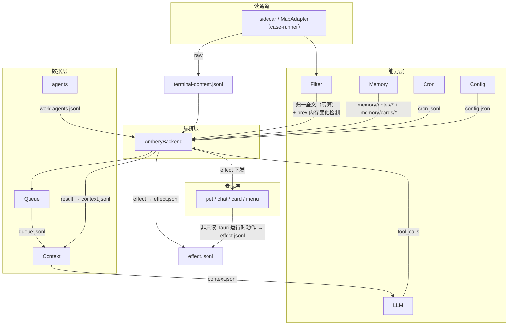

# Module Storage Flow

English | [中文](module-storage-flow.zh.md)

Code module layering + processing flow (storage files appear only on arrows) + presentation layer / effect. Two versions of the same view: ASCII and Mermaid.

## ASCII

```
══════════════════════ 代码模块分层 ══════════════════════

  表现层    前端窗口：pet / chat / card-* / menu（Tauri，非 headless）
  ─────────────────────────────────────────────────────────
  编排层    AmberyBackend（ambery.rs）
            handle_hook │ handle_timer_scan │ run_trigger │ execute_tool │ drain_queue
  ─────────────────────────────────────────────────────────
  能力层    Filter（filter.rs）│ LLM（llm.rs）│ Timer（timer.rs）
            Lifecycle（lifecycle.rs）│ Memory（memory.rs）│ Cron（cron.rs）│ Config（config/）
  ─────────────────────────────────────────────────────────
  数据层    Harness：Queue（queue.rs）│ Context（context.rs）│ EventBuffer（event_buffer.rs）│ agents
  ─────────────────────────────────────────────────────────
  读通道    sidecar / MapAdapter（case-runner）（外部输入）
  ─────────────────────────────────────────────────────────
  存储层    JsonlStore（storage.rs）读写 storage/*；ConfigStore 读写 config.json

══════════════════════ 处理流（storage 文件名只在箭头上）══════════════════════

  外部 Hook / User 输入
        │
        ▼
  ┌────────────┐
  │  读通道     │  读 Terminal Content
  │ sidecar/   │
  └─────┬──────┘
        │ raw
        │
        ├────────[terminal-content.jsonl]────────▶  原文全档
        │        （fetch_terminal 回退/追问从此现算 digest）
        ▼
  ┌────────────┐   digest → 归一全文（现算，不持久）
  │  能力层     │
  │  Filter    │───▶ 变化检测（prev 内存）──▶ 有变化 → 提示消息
  └────────────┘
        │
        ▼
  ┌────────────┐  入队             ┌────────────┐
  │  数据层     │─[queue.jsonl]──▶  │  数据层     │  放行
  │  Queue     │                   │  Context   │
  └────────────┘                   └─────┬──────┘
                                         │ 追加消息
                                         ▼
                                  ┌────────────┐
                                  │  能力层     │
                                  │  LLM       │─[context.jsonl]──▶（装配 head/autonomy/usage）
                                  └────────────┘
                                         │ tool_calls
                                         ▼
                                  ┌────────────┐
                                  │  编排层     │  execute_tool
                                  │ Ambery-  │
                                  └──┬─────┬───┘
                                     │     │
                           result    │     │  effect
                             │       │     │
                             ▼       │     ├────[effect.jsonl]────▶ 动作流全档
                       [context.jsonl] │     │   （后端副作用 + 非只读 Tauri 运行时动作）
                     （tool message）   │     ▼
                                       │  ┌────────────┐
                                       │  │  表现层     │
                                       │  │ pet/chat/  │
                                       │  │ card/menu  │
                                       │  └────────────┘
                                       │  （RenderComponent/CloseComponent/
                                       │   SetAutonomy/ConfigChanged/
                                       │   AssistantDelta）
                                       ▼
                                 （回 LLM 循环 → 最终回复）

  ── 其余模块 ↔ storage 的箭头 ──
  [编排层 agents]  ──[work-agents.jsonl]──▶  投影（实例生命周期）
  [能力层 Memory]  ──[memory/notes/* + memory/cards/*]────────▶  持久化理解
  [能力层 Cron]    ──[cron.jsonl]──────────▶  计划/延时
  [配置层 Config]  ──[config.json]──────────▶  装配
```

## Mermaid


