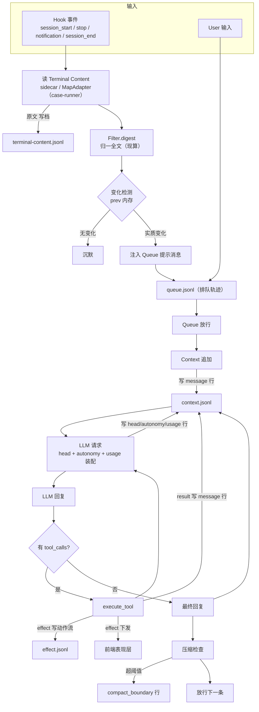

# Processing Flow

主处理流程（storage 布局 + 每步写什么日志）。同一视图的 ASCII 与 Mermaid 两版。

## ASCII

```
═══════════════════ 存储布局 ═══════════════════

  Config 域                              Storage 域
  %CONFIG_DIR%/                          %STORAGE_DIR%/
  config.json      启动配置              queue.jsonl             Queue 排队轨迹
  AGENTS.md        身份提示词            terminal-content.jsonl  终端原文（Filter 前）
                                        context.jsonl           统一全保真日志
                                        work-agents.jsonl       实例生命周期
                                        effect.jsonl            前后端统一动作流
                                        memory/                 工作空间（notes/ + cards/）
                                        cron.jsonl              Cron 计划

context.jsonl 的行 type（统一信封 {type, ts, ...}）：
  message           对话消息（role/content/tool_calls/reasoning_content）
  autonomy          表情状态 [face, motion]（每轮一条）
  head              请求头快照（变化才写）
  usage             token 真值（每次 LLM 调用）
  compact_boundary  压缩边界
  session           会话分界
  （content 行型：归一全文不持久化，现算）

effect.jsonl（独立动作流日志，{type:"effect", origin, kind, payload, ts}）：
  后端副作用（execute_tool / config / 流式 delta+done）+ 非只读 Tauri 运行时动作上报

═══════════════════ 处理流程 + 每步写什么日志 ═══════════════════

 ① Hook 触发（session_start / stop / notification / session_end）
      │
      ▼
 ② 读 Terminal Content（sidecar / MapAdapter（case-runner））
      │
      ├──▶ 原文  ──────────────────────────▶ terminal-content.jsonl
      ▼
 ③ Filter.digest → 归一全文（现算）
      │        ▲ 同时读 prev（内存上次归一全文）做变化检测
      ▼
 ④ 实质变化? ──是──▶ 注入 Queue（提示消息）──▶ queue.jsonl
      │                                              │
      ▼                                              ▼
      （无变化：沉默）                         ⑤ Queue 放行
                                                   │
                                                   ▼
                                              Context 写输入 ──▶ context.jsonl [message 行]
                                                   │
                                                   ▼
                                             ⑥ LLM 请求（装配）
                                                   │  head  ──▶ [head 行]
                                                   │  autonomy ──▶ [autonomy 行]
                                                   │  usage ──▶ [usage 行]
                                                   ▼
                                             ⑦ LLM 回复
                                                   │  assistant 消息 ──▶ [message 行]
                                                   ▼
                                              ⑧ tool_calls ──▶ execute_tool
                                                    │  result  ──▶ [message 行]（tool role）
                                                    │  effects ──▶ effect.jsonl（全量）+ 发前端执行
                                                    ▼
                                             ⑨ 循环（⑦→⑧）直到无 tool_calls ──▶ 最终回复
                                                   │
                                                   ▼
                                             ⑩ 压缩检查（超阈值）
                                                   │  compact_boundary ──▶ [compact_boundary 行]
                                                   ▼
                                             ⑪ Queue 放行下一条

═══════════════════ 数据流概要 ═══════════════════

  终端文字 ─▶ [terminal-content.jsonl] 原文
     ─▶ Filter ─▶ 归一全文（现算，不持久）
     ─▶ 变化? ─▶ Queue ─▶ [message] Context ─▶ LLM ─▶ [message/head/autonomy/usage]
     ─▶ tool 执行 ─▶ [message] result + effect.jsonl 动作流 ──▶ 前端
  Tauri 运行时动作 ─▶ [effect.jsonl]（非只读动作上报，高频打包）
  实例状态 ─▶ [work-agents.jsonl]
  Queue 输入 ─▶ [queue.jsonl]
  计划/记忆 ─▶ [cron.jsonl] / [memory/]
```

## Mermaid


