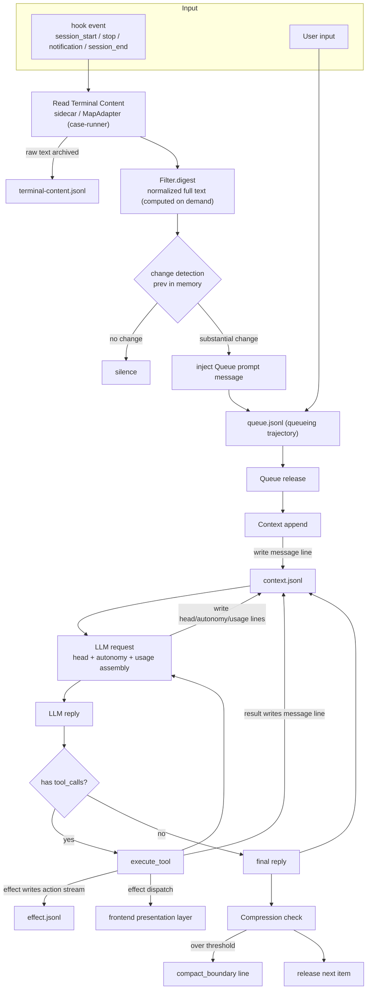

# Processing Flow

English | [中文](processing-flow.zh.md)

Main processing flow (Storage layout + what log is written at each step). The same view in two versions, ASCII and Mermaid.

## ASCII

```
═══════════════════ Storage Layout ═══════════════════

  Config domain                          Storage domain
  %CONFIG_DIR%/                          %STORAGE_DIR%/
  config.json      launch config         queue.jsonl             Queue queueing trajectory
  AGENTS.md        identity prompt       terminal-content.jsonl  terminal raw text (before Filter)
                                         context.jsonl           unified full-fidelity log
                                         work-agents.jsonl       instance lifecycle
                                         effect.jsonl            frontend/backend unified action stream
                                         memory/                 workspace (notes/ + cards/)
                                         cron.jsonl              Cron schedule

context.jsonl line types (unified envelope {type, ts, ...}):
  message           conversation message (role/content/tool_calls/reasoning_content)
  autonomy          expression state [face, motion] (one per turn)
  head              request head snapshot (written only on change)
  usage             token ground truth (every LLM call)
  compact_boundary  Compression boundary
  session           session boundary
  (content line type: normalized full text is not persisted; computed on demand)

effect.jsonl (independent action-stream log, {type:"effect", origin, kind, payload, ts}):
  backend side effects (execute_tool / config / streaming delta+done) + non-read-only Tauri runtime action reporting

═══════════════════ Processing Flow + What Log Each Step Writes ═══════════════════

 ① hook fires (session_start / stop / notification / session_end)
      │
      ▼
 ② read Terminal Content (sidecar / MapAdapter (case-runner))
      │
      ├──▶ raw text  ─────────────────────▶ terminal-content.jsonl
      ▼
 ③ Filter.digest → normalized full text (computed on demand)
      │        ▲ simultaneously read prev (last normalized full text in memory) for change detection
      ▼
 ④ substantial change? ──yes──▶ inject into Queue (prompt message)──▶ queue.jsonl
      │                                              │
      ▼                                              ▼
      (no change: silence)                      ⑤ Queue releases
                                                    │
                                                    ▼
                                               Context writes input ──▶ context.jsonl [message line]
                                                    │
                                                    ▼
                                              ⑥ LLM request (assembly)
                                                    │  head  ──▶ [head line]
                                                    │  autonomy ──▶ [autonomy line]
                                                    │  usage ──▶ [usage line]
                                                    ▼
                                              ⑦ LLM reply
                                                    │  assistant message ──▶ [message line]
                                                    ▼
                                               ⑧ tool_calls ──▶ execute_tool
                                                     │  result  ──▶ [message line] (tool role)
                                                     │  effects ──▶ effect.jsonl (full) + dispatch to frontend
                                                     ▼
                                              ⑨ loop (⑦→⑧) until no tool_calls ──▶ final reply
                                                    │
                                                    ▼
                                              ⑩ Compression check (over threshold)
                                                    │  compact_boundary ──▶ [compact_boundary line]
                                                    ▼
                                              ⑪ Queue releases the next item

═══════════════════ Data Flow Summary ═══════════════════

  terminal text ─▶ [terminal-content.jsonl] raw
     ─▶ Filter ─▶ normalized full text (computed on demand, not persisted)
     ─▶ changed? ─▶ Queue ─▶ [message] Context ─▶ LLM ─▶ [message/head/autonomy/usage]
     ─▶ tool execution ─▶ [message] result + effect.jsonl action stream ──▶ frontend
  Tauri runtime action ─▶ [effect.jsonl] (non-read-only action reporting, high-frequency packed)
  instance state ─▶ [work-agents.jsonl]
  Queue input ─▶ [queue.jsonl]
  schedule/memory ─▶ [cron.jsonl] / [memory/]
```

## Mermaid


